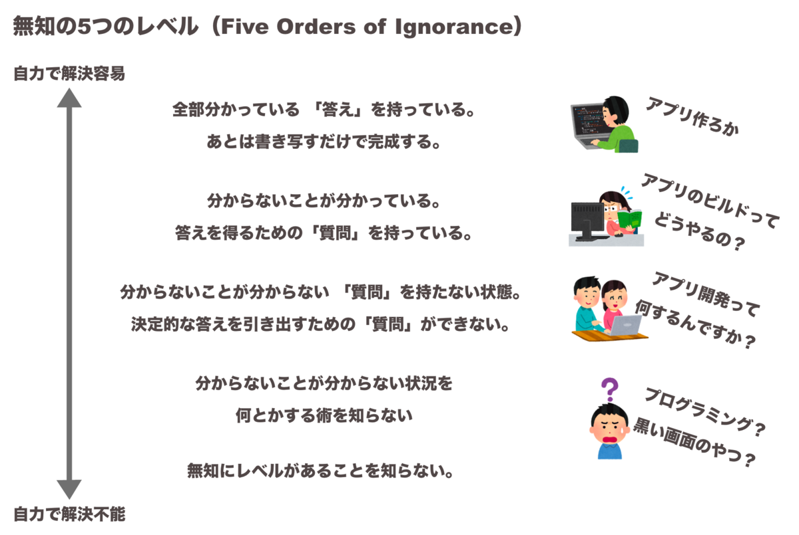
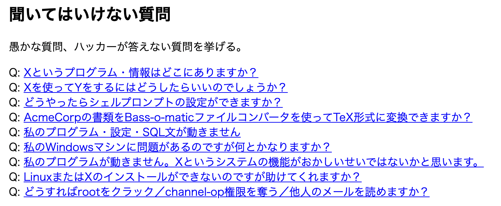
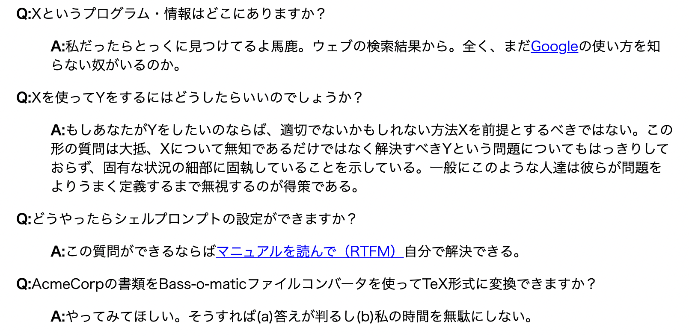
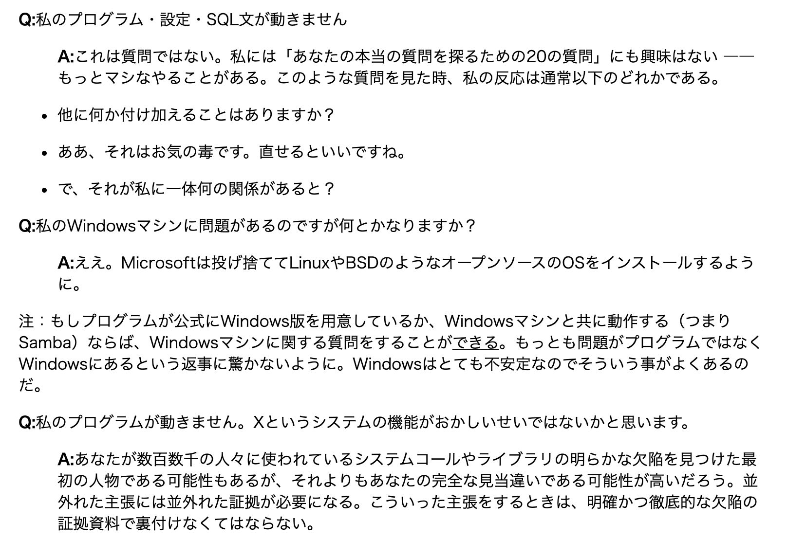
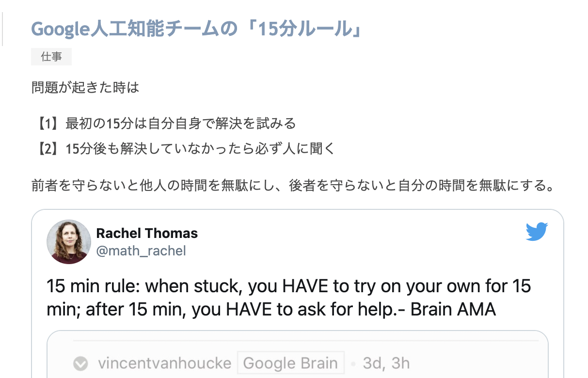

YouTube動画[【正しい質問のしかたセミナー】スクール行かずにエンジニアになる方法④](https://youtu.be/K5Nqkt--WgA) の資料です


# 70万円払わずにエンジニアになる方法④

### はじめに
- テックキャンプの受講料が高すぎてびっくりした.
- スクールの価値を分析して代替案(=独学方法)を考えてみるシリーズ.
  - ※第一回: おすすめ教材紹介する回
  - ※第二回:テックキャンプ最終課題を動かしてみる回
  - ※第三回(前回):勉強をモチベートしてくれる環境解説
  - ※今回「不明点を聞ける環境」解説
  - 台本作った結果
  「正しい質問のしかた」セミナーになりましたｗ
##
##
##

---

## コメント嬉しいです🥰ありがとうございます！
- いいね, コメント が自分のやる気につながります.いつもありがとうございます🙇‍♂️
- このテーマ(エンジニアになる方法)についてもっと深堀りしてほしい人は
  - コメントいただけると嬉しいです！
- (飽き性なので、 反応ないと、本テーマは打ち切りになりますｗ)
##
##
##
##
##
##


---

## (前回と同じ)まずはゴールを決める
- ゴール「メルカリのようなWebサービスをつくれるスキルを身につけること」

##### 補足
- Webアプリです
- iOSアプリではありません
- Androidアプリではありません
##
##
##


---

## (前回と同じ)プランをたてる
- 仕事をやめない
- 平日や、土日で時間を捻出する
  - 他のプライベート予定(SNS, ゲーム, YouTube, デートetc.)は捨てる
- 3ヶ月という短期間で勝負だ！
  - それ以上の長期戦だとダラける
##
##
##
##
##

---

## (前回と同じ)プログラミングスクールの価値とは
プログラミングスクールの価値を考えてみた. これらの切り口で解説していく.

1. 教材
2. ポートフォリオになりうる成果物
3. 勉強をモチベートしてくれる環境
4. わからないときに教えてくれる人がいる環境
5. 転職支援
6.  ***(new!)*** 同じ目標を持った仲間ができること
7.  ***(new!)*** エンジニアに添削してもらえる環境
##
##
##

---

## 代替案
1. 教材 ***→本や動画教材(Progate, dotinstall, Udemy)で十分＝第一回で解説***
2. ポートフォリオになりうる成果物 ***→第二回で解説***
3. 勉強をモチベートしてくれる環境
  ***→オンラインサロンとかアプリとか利用＝第三回(前回)で解説***
4. わからないときに教えてくれる人がいる環境 ***→『MENTA』とか＝今回解説***
5. 転職支援　***→転職しないので今回は不要***
6.  ***(new!)*** 同じ目標を持った仲間ができること***＝第三回(前回)で解説***
7.  ***(new!)*** エンジニアに添削してもらえる環境***→オンラインサロン?***
##
##
##
##

---

## 結論
- Q&Aサイト『Stack Overflow』を使って質問しよう
#### もし難しかったら...
- メンター探せるサービス『MENTA』でメンターに聞いてみよう
  - ただしお金かかるよ
  - 今回の趣旨(安く学習する方法)に反する... → 解説しません
  - **「プロのエンジニア」の人件費は高い**
    - 👆ここ認識お願いします. 👆
    - 逆にいうと独学において"ここ"にしかお金はかからない.
    -  他 「情報」は無料(ほぼ). 金払うな🙅‍♂️
##
##
##


---

## Q&Aサイト『Stack Overflow』をおすすめする理由
- teratailは？
  - 質問のクオリティ低め(プログラミング以外も散見される)
  - 回答者 集まってなさそう(※主観です)
- teratailに比較して、 Stack Overflow は...
  - ちゃんと技術系の「プログラミング」についての質問が多い
  - 回答者も集まってそう(※主観です)
    - エンジニアであれば「バッジ」をもらうんだったらstackoverflowの方がよい
      - 世界一の技術系Q&Aサービスの「バッジ」は格別
### Stack Overflowで質問してみよう
##
##

---

## でもどうやって質問すれば？
## 正しい答えを得られるための質問はどうやってすればよい？
## →本題です

# 「正しい質問のしかた」セミナー

## この動画を見ているあなたに「質問力」を授けたい...!
## リモートワーク時代にこそ必須なスキル...! 現場でも使える...!
##


## 正しい質問のしかた セミナー 目次
- 1.自分の「無知レベル」を知ろう
- 2.この質問テンプレで質問してみよう
- 3.質問における7つの習慣とは
- 4.「悪い質問」しないようにしよう
- 5.質問するときの心得とは
- 6.どのくらいの 試行錯誤してから質問すべき？
##
##
##
---

## 1.自分の「無知レベル」を知ろう
### 無知にはレベルがある. [Five orders of Ignorance](http://la-acm.org/Archives/laacm0512-Article%2002%20The%205%20Orders%20of%20Ignorance%20OCT%202000.pdf)
- :laughing: ***0OI: 全部分かっている***
「答え」を持っている。あとは書き写すだけで完成する。

- :smile: ***1OI: 分からないことが分かっている***
答えを得るための「質問」を持っている。

- :worried: ***2OI: 分からないことが分からない***
「質問」を持たない状態。決定的な答えを引き出すための「質問」ができない。

- :weary: ***3OI: 分からないことが分からない状況を何とかする術を知らない***
2OI→1OI→0OIと進んでいくためのプロセスがない状態です。

- :astonished: ***4OI: 無知にレベルがあることを知らない***

※ OI: Order Ignorance

###### 出典:[質問は恥ではないし役に立つ](https://qiita.com/seki_uk/items/4001423b3cd3db0dada7)

---



###### 出典：[仮想サーファーの日常](https://www.virtual-surfer.com/entry/no-ggrks)

---
## 各レベルの対処方法
### 3OI: この状況を脱する術(プロセス)を知らない場合
- 質の高い書籍や教材を教えてもらおう ***→第一回で教材を解説済み***

### 2OI： 的確な質問を持っていない場合
- What(何をしてるか)とWhy(なぜそれをやってるか)書こう. 
  - ***そもそも*** それ(What) をしている理由を、回答者は知りたい.
  - 方向が間違ってるかもしれない
- もしくは「こういったケースではどういうことが原因の可能性がありますか?」のように、心当たりのある点をすべて列挙してもらうのもあり

### 1OI: 質問を持っている場合
- テンプレ使って質問してみよう→Step2へ


---

## 2.この質問テンプレで質問してみよう
```
○○を実行すると、○○というエラーになる問題で困っています。
原因または解決策をご存知の方はいらっしゃいませんか。

私の行った手順は以下です。
(1)
(2)
(3)

すると、以下のような結果になりました。

【表示されたものをコピー＆ペーストする】

私は【予想結果】になると思いました。
なぜなら、【参考資料】には、
以下のように書かれているからです。

> 【適切な分量の引用】
> 【適切な分量の引用】
> 【適切な分量の引用】

原因を確かめるため、以下のようなテストを行ってみましたが、
問題の解決には至りませんでした。

(a) 入力を○○ではなく××にしてみた
→上記と同じ結果になった

(b) ソースプログラムの○○をやめて、××にした
→以下のようなコンパイルエラーになった

【エラーメッセージのコピー＆ペースト】

なお、私の環境は以下の通りです。
【マシン, メモリ量, 関連周辺機器, OS, 利用ソフト, バージョンなどを箇条書きに】

検索エンジンで○○、××、△△を検索しましたが、
◎◎に関するページばかりで、解決に役立つ情報は見つかりませんでした。
過去の質問も調べましたが、
○○に関する話題は見つかりませんでした。

よろしくおねがいします。
```
以上. 
結城浩さん[技術系メーリングリストで質問するときのパターン・ランゲージ](http://www.hyuki.com/writing/techask.html#wrapup)より一部加筆修正してます

---

### 余談: 結城浩さんといえば、Javaエンジニアにはこの本おすすめです
#### 「デザインパターン」を知りたい人へ
[『増補改訂版Java言語で学ぶデザインパターン入門』結城浩](https://amzn.to/30Pg4ua)


 

---

## 3.質問における7つの習慣 ※現場でも使えます
1. 冒頭/タイトルに「要約」を書く
2. 試した「試行手段(手順)」を詳細に書く
3. その「結果(エラーメッセージ)」を詳細に書く コピペで！
4. 「期待した結果」を書く
5. 環境(マシン名, OS, ソフトウェアなど)をバージョンを含めて詳細に書く
6. GoogleやStack Overflowで検索した結果を書く
7. 公式ドキュメントで探した結果を書く

## →すべて書かれていたら「良い質問」です
##
##
---

## 付録：質問する際のチェック項目

- [ ] タイトルに要約を書いたか？
- [ ] 試行手段の手順を書いたか？
- [ ] 結果のエラーメッセージをコピー&ペーストしたか？
- [ ] 期待した結果を書いたか？
- [ ] 実行した環境(マシン名, OS, ソフトウェア)をバージョン含めて書いたか？
- [ ] GoogleやStack Overflowで検索した結果を書いたか？
- [ ] 公式ドキュメントで探した結果を書いたか？
##
##
##

---

## 逆に 「悪い質問」とは？

---

### 4. 「悪い質問」しないようにしよう
## 悪い質問の具体例を挙げる
- エリック・レイモンド(ESR)さんの[賢い質問のしかた](https://www.ranvis.com/articles/smart-questions.ja.html#classic)から引用
  - エリック・レイモンド
    - OSSの先駆者, ソフトウェアエンジニア
    - ソフトウェア開発のエッセイ[『伽藍とバザール』](https://cruel.org/freeware/cathedral.html)著者
  - 辛辣ですｗ
##
##
##


---
## 悪い質問の具体例(すべて引用)
###### 以下引用



---


---


---

## 5.質問するときの心得
- 「魚をくれ」ではなく「魚の釣り方」を教わるようにしよう
- 回答をもらったら速く返信しよう
- 回答をもらったら必ずお礼を言おう
- 問題が解決したときには回答者に必ず報告しよう
##
##
##
##

---

## 6.どのくらいの時間 試行錯誤してから質問すべき？
### 答え：初学者は60分〜150分くらいだと思う（主観）

- [Google人工知能チームの「15分ルール」](https://tkybpp.hatenablog.com/entry/2016/08/16/173055) の応用(天才は15分). 

- `①最初の60分は自分自身で解決を試みる`
- `②60分後も解決していなかったら必ず人に聞く`
- `前者を守らないと他人の時間を無駄にし、後者を守らないと自分の時間を無駄にする`



---

## 動画まとめ
- Stack Overflowで質問してみよう
- 自分の無知レベルを知って、質問テンプレを使ってみよう
- [独学]エンジニアの人件費(添削など)が 何より高いことを認識しよう

##
##
##
##
##
##

---

## (前回と同じ)今回調べて思ったこと
- 独学の環境は過去最高にいい！あとはやるだけ！
- 10万円以下でゴールを達成できる
- 70万円なんて払わなくてよい

### 「独学イノベーション」〜エンジニア転職成功まで
- 教材：ProgateやUdemyで価格破壊
- 同じ目標もった人との交流：オンラインサロンで価格破壊
- モチベーション管理：Studyplusで価格破壊 **※まだ改善余地がある**
- 不明点を聞ける環境：Stack Overflow, MENTA **←質問力について今回解説**
- エンジニアに添削してもらえる環境：MENTA, オンラインコミュニティ
- (転職：Wantedlyで価格破壊)

---
## 疑問点🤔　まだコメントしてない方お願いします🙇‍♂️

### エンジニアになりたい人へ：どの不満や悩みが大きいですか？
- ①何を勉強すればよいかわからない
- ②質問できる人がいない `←ここが大きい?🤔`
- ③同じ目標をもった仲間がほしい `←ここが大きい?🤔`
- 他, なんでも...
  - どこを目指していいのかわからない
  - プログラミングの使い道(副業?転職?)がわからない
  - 自分のやりたいことがわからない

## コメントください！
##
##
---

## 「正しい質問のしかた」台本づくり オサミーが頑張れたのは ssさんのおかげ


## ありがとうございます！ みんなにも役立ってるはず😊 
## みんなコメントしてね
## 
##
##

---

## 次回
- 「質問できる人がいない」についてまだ深堀りできるかも

### →好評だったら解説します
  - いいねやコメントお待ちしております！
##
##
##
##
---

##### このチャンネル運用, 試行錯誤中なんです. 中途半端ですいません🙇‍♂️
- 頻度高く更新していきます
##
##
##
##
##
##
